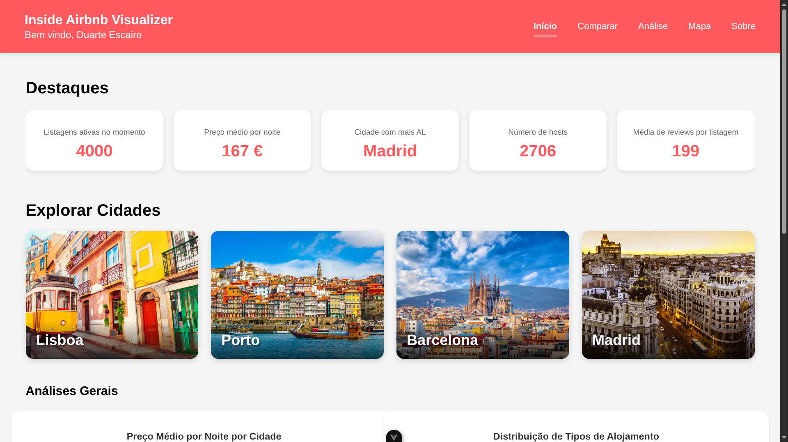

# IPM (Interface Pessoa-Máquina) (Português)
Interface de um sistema de visualização de dados para a plataforma [InsideAirbnb](https://insideairbnb.com/get-the-data/) implementado no âmbito da cadeira de Interface Pessoa-Máquina. O projeto foi dividido em duas fases: prototipagem e implementação. É possível consultar o respetivo [enunciado](Enunciado.pdf) e o [relatório](Relatorio-fase-1.pdf) da fase 1 (não foi necessário fazer um para a 2ª fase).



## Membros do grupo
* [darteescar](https://github.com/darteescar)
* [luis7788](https://github.com/luis7788)
* [tiagofigueiredo7](https://github.com/tiagofigueiredo7)

## Fase 1 -  Prototipagem
Pode consultar o protótipo no respetivo [link](https://www.figma.com/proto/omZfsshqbyfBFcyr9Djr4o/TP_IPM?node-id=0-1&t=0bZyXUYJHC5JjvwZ-1) e o [design](https://www.figma.com/design/omZfsshqbyfBFcyr9Djr4o/TP_IPM?node-id=0-1&t=0bZyXUYJHC5JjvwZ-1) completo também.

## Fase 2 - Implementação

### Compilação
Para correr a aplicação localmente, siga os seguintes passos:

Vá para a diretoria *visualizer-app/*

```sh
cd visualizer-app/
```

Instale todas as dependências necessárias fazendo:

```sh
npm install
```

É necessário correr um servidor json-server de backend. Para isso, na diretoria *visualizer-app/* faça:

```sh
npx json-server --watch backend/db.json --port 3000
```

Para compilar a aplicação e abrir no browser faça (dentro da diretoria *visualizer-app/*):

```sh
npm run dev
```

# IPM (Human-Computer Interface) (English)
Data visualization system interface for the [InsideAirbnb](https://insideairbnb.com/get-the-data/) platform. Implemented within the scope of the Human-Computer Interface course. The project was divided into two phases: prototyping and implementation. You can check the respective [statement](Enunciado.pdf) and the [report](Relatorio-fase-1.pdf) of phase 1 (it was not necessary to make one for phase 2).

## Group Members
* [darteescar](https://github.com/darteescar)
* [luis7788](https://github.com/luis7788)
* [tiagofigueiredo7](https://github.com/tiagofigueiredo7)

## Phase 1 - Prototyping
You can check the prototype at the respective [link](https://www.figma.com/proto/omZfsshqbyfBFcyr9Djr4o/TP_IPM?node-id=0-1&t=0bZyXUYJHC5JjvwZ-1) and the complete [design](https://www.figma.com/design/omZfsshqbyfBFcyr9Djr4o/TP_IPM?node-id=0-1&t=0bZyXUYJHC5JjvwZ-1) as well.

## Phase 2 - Implementation

### Compilation
To run the application locally, follow these steps:

Go to the *visualizer-app/* directory

```sh
cd visualizer-app/
```

Install all necessary dependencies by running:

```sh
npm install
```

It is necessary to run a json-server as backend. To do this, in the *visualizer-app/* directory run:

```sh
npx json-server --watch backend/db.json --port 3000
```

To compile the application and open it in the browser run (inside the *visualizer-app/* directory):

```sh
npm run dev
```